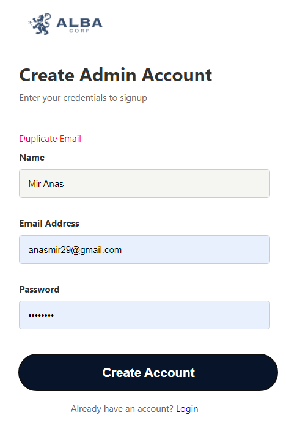
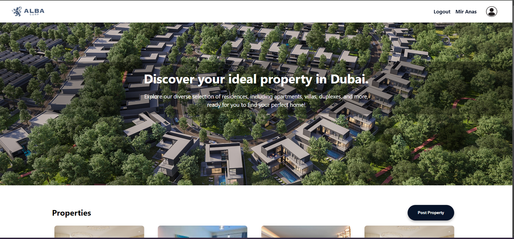
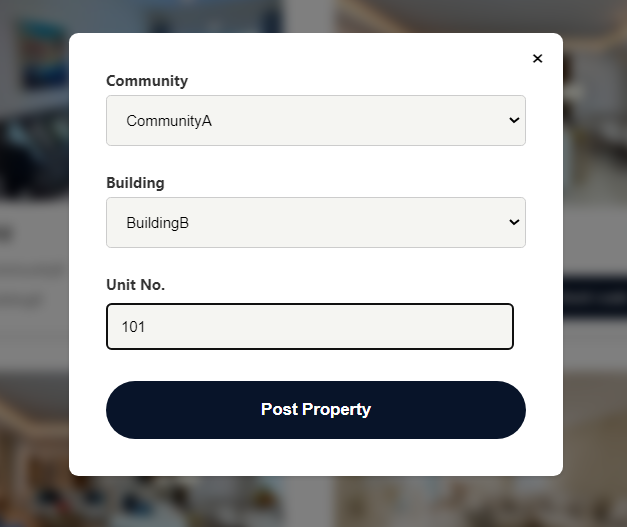
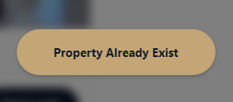
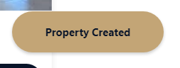
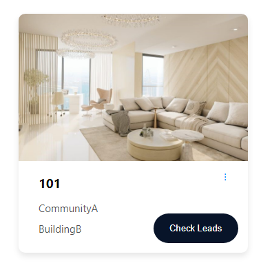
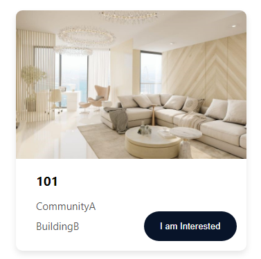
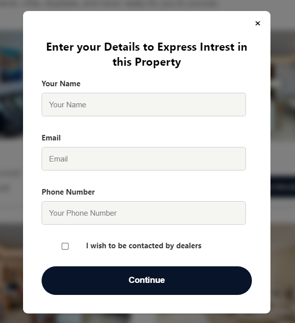

# ALBA Properties Demo

This project is a web-based application built using Node.js, Express, and MongoDB that allows users to manage properties by creating and editing property details.

## Table of Contents

-   [Live Demo](#live-demo)
-   [Installation](#installation)
-   [Technologies Used](#technologies-used)
-   [API Endpoints](#api-endpoints)
-   [MongoDB Models](#mongodb-models)
-   [Component Details (REACT)](#component-details-react)
-   [Backend Structure](#backend-structure)
-   [Contact](#contact)

## Live Demo

## Live Demo

Check out the live version :

-   **Admin Website**: [https://alba-demo-sepia.vercel.app/admin/home](https://alba-demo-sepia.vercel.app/admin/home)
-   **Client Website**: [https://alba-demo-sepia.vercel.app/home](https://alba-demo-sepia.vercel.app/home)

Note: The first request is going to take around 60 secs to start the server.

## Installation

1. Clone the repository:

    ```bash
    git clone https://github.com/miranas11/ALBA.git
    ```

2. Change the ENV setting in config.js from "PROD" to "DEV"

    For frontend

    ```bash
    cd frontend/src/config.js
    ```

    For Backend

    ```bash
    cd backend/config.js
    ```

3. Install the dependencies and start servers:

    ```bash
    cd backend
    npm install
    node server.js
    ```

    ```bash
    cd frontend
    npm install
    npm start
    ```

## Technologies Used

### Backend

-   Node.js: A JavaScript runtime built on Chrome's V8 JavaScript engine.
-   Express.js: A minimal and flexible Node.js web application framework that provides a robust set of features for web and mobile applications.
-   MongoDB ATLAS: A NoSQL database for modern applications that use a flexible, JSON-like format to store data.
    data.

### Frontend

-   React: A JavaScript library for building user interfaces, maintained by Facebook and a community of individual developers and companies.

### Tools and Packages

-   jwt (JSON Web Tokens): A compact, URL-safe means of representing claims to be transferred between two parties. It is used for authentication and authorization.
-   bcrypt: A library to help you hash passwords.
-   cors: A package for providing a Connect/Express middleware that can be used to enable CORS with various options.
-   cookie-parser: Parse Cookie header and populate req.cookies with an object keyed by the cookie names.
-   mongoose: An ODM (Object Data Modeling) library for MongoDB and Node.js that provides a straight-forward, schema-based solution to model your application
-   express.js: A minimal and flexible Node.js web application framework.
-   axios: A promise-based HTTP client for the browser and Node.js.
-   react-router-dom: A collection of navigational components that compose declaratively with your application.
-   js-cookie: A simple, lightweight JavaScript API for handling browser cookies.

## API Endpoints

| HTTP Verbs | Endpoints                             | Action                                   |
| ---------- | ------------------------------------- | ---------------------------------------- |
| POST       | /auth/register                        | To sign up a new admin account           |
| POST       | /auth/login                           | To login an existing admin account       |
| POST       | /auth/saveUser                        | To save a user account                   |
| POST       | /property/create                      | To create a new property                 |
| POST       | /property/addLead/:propertyId/:leadId | To add lead to a property                |
| PATCH      | /property/edit/:propertyId            | To edit the details of a single property |
| DELETE     | /peroperty/delete/:propertyId         | To delete a single property              |
| GET        | /property/getAll                      | To get all properties                    |

## MongoDB Models

### PropertyCard Model

-   To make sure that there are no property with same community,building and unit we are creating a index of combination of all three properties.

```javascript
const PropertyCardSchema = new Schema({
    community: {
        type: String,
        enum: communityEnum,
        required: true,
    },
    building: {
        type: String,
        enum: buildingEnum,
        required: true,
    },
    unitNo: {
        type: String,
        required: true,
    },
    leads: [
        {
            type: Schema.Types.ObjectId,
            ref: "User",
        },
    ],
});
PropertyCardSchema.index(
    { community: 1, building: 1, unitNo: 1 },
    { unique: true }
);
```

### User Model

```javascript
const UserSchema = new Schema({
    name: {
        type: String,
        required: true,
    },
    email: {
        type: String,
        required: true,
        unique: true,
    },
    phoneNumber: {
        type: Number,
        required: true,
        unique: true,
    },
});
```

### Admin Model

```javascript
const AdminSchema = new Schema({
    name: {
        type: String,
        required: true,
    },
    email: {
        type: String,
        required: true,
        unique: true,
        lowercase: true,
    },
    password: {
        type: String,
        required: true,
    },
});

AdminSchema.statics.findAndValidate = async function (email, password) {
    const foundUser = await this.findOne({ email });
    if (!foundUser) return false;
    const validPassword = await bcrypt.compare(password, foundUser.password);
    return validPassword ? foundUser : false;
};

AdminSchema.pre("save", async function (next) {
    if (!this.isModified("password")) next();
    this.password = await bcrypt.hash(this.password, 12);
    next();
});
```

## Component Details (REACT)

### Home Component (login and Register) for Admin only

-   This component opens a login page has a link to switch the login component to register
-   If the validaiton of the mongoDB are not met we get the message from the backend and show it in red as error
    

-   After succesfull login or register we get a jwt token that we store in the localStorage also we decode the token and store the decoded data in adminData cookie which is then used to show the name of admin in navbar.
    
-   Also if we try to open the PropertyPage with login on the admin side it checks if token is present then goes to backend to validate the token if both false the it redirects to login page

### PropertyList for Admin and User

-   After succesfull login or after user visiting the site we show the porpertylist component that contains an navbar ,a timeline image and then the list of properties shown using propertyCard component.
    
-   Here we make a call to backend to get all the properties data and map every propety to a propertyCard
-   For admin we have a button to create a new propety
    <br>
    
-   Whenver we create a property,show interest or get a message we show a dialogue box a bottom right corner.
    
    

### PropertyCard for Admin and User

-   This contains a image and data of a property.
-   For admin we have a show leads button that shows how many users are intrested in that property.
-   For users we have a i am intrested button that opens a form to submit their interest.
    
    
-   Clicking on the i am intrested button shows up a form to fill you details
-   After the user fills the intrested form the user data is stored context and if we click i am intrested again on other property we dont have to fill the form again.
    <br>
    
-   After filling the form we call the addLead Api and add the user as lead to that particular property

### AuthRoute (Higher Order Comonent)

-   Created a higher order component to make sure that admin is logged in and the jwt token is valid.
-   If it is not valid or admin is not logged in it redirects to login page

```javascript
const AuthRoute = ({ children }) => {
    const [isLoading, setIsLoading] = useState(true);
    const navigate = useNavigate();

    useEffect(() => {
        const token = localStorage.getItem("token");
        if (!token) {
            navigate("/admin");
            return;
        }
        const validate = async () => {
            const response = await authController.validateToken();
            console.log(response);
            if (response.status === 500) {
                navigate("/admin");
            } else {
                setIsLoading(false);
            }
        };

        validate();
    }, [navigate]);

    return isLoading ? <Loading /> : <div>{children}</div>;
};
```

## Backend Structure

### isAuthorized Middleware

-   We use this middleware in all the api calls that needs a admin logged in
-   We send the jwt token in the header of request on this middleware validated the jwt token
-   If no token or validation fails to sends the corresponding error code and message and we handle and redirect to login page in front end

```javascript
const isAuthorized = (req, res, next) => {
    const header = req.headers["authorization"];

    const token = header.slice(7);

    if (!token) {
        return res.status(403).json({ error: "No token provided" });
    }

    jwt.verify(token, config.secretKey, (err, user) => {
        if (err) {
            return res
                .status(500)
                .json({ error: "Failed to authenticate token" });
        }

        req.user = user;

        next();
    });
};
```

### JWT creation

-   After creating new user or succesful login of user we create a jwt token and send it in response.

```javascript
const token = jwt.sign(
    { email: admin.email, name: admin.name },
    config.secretKey,
    { expiresIn: "1h" }
);
res.status(201).json({ userCreated: true, token: token });
```

### Password Ecnryption (bcrypt)

-   We used bcrypt ot encrypt password
-   We created methods in the adminModel itself.
-   First method is called whenever we save a docuemnt of Admin Model.The pre method is called before saving so it modifies a ecnrypts in password before saving
-   In second method we are creating out own method findAndValidate which is used when we are trying to login in it finds the users and checks if the password matches

```javascript
AdminSchema.pre("save", async function (next) {
    if (!this.isModified("password")) next();
    this.password = await bcrypt.hash(this.password, 12);
    next();
});

AdminSchema.statics.findAndValidate = async function (email, password) {
    const foundUser = await this.findOne({ email });
    if (!foundUser) return false;
    const validPassword = await bcrypt.compare(password, foundUser.password);
    return validPassword ? foundUser : false;
};
```

## Contact

If you have any questions or suggestions, please contact:

-   Name: Mir Anas
-   Email: anasmir24@gmail.com
